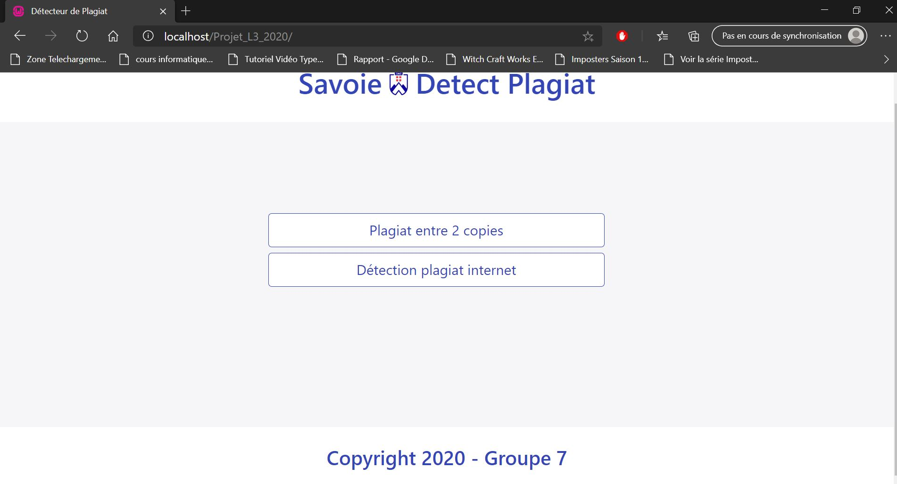

## Démonstration 

## Technologie utilisé

Composer : gestionnaire de dépendances dans ce projet
[telecharger composer]  (https://getcomposer.org/ "lien vers composer")

le ficher key.json contient la clée pour utiliser cloud vision
Pour utiliser cloud vision il faut l'installer dans le projet
 Cloud vision    =>   composer require google/cloud-vision

Curl est la bibliothèque permettant d'accéder a un contenu web  ,
pour l'instant elle n'est pas utiliser
Curl pour la capture de page web  =>  composer require curl/curl

FPDF bibliothèque permettant de créer un pdf
FPDF    =>    composer require fpdf/fpdf

